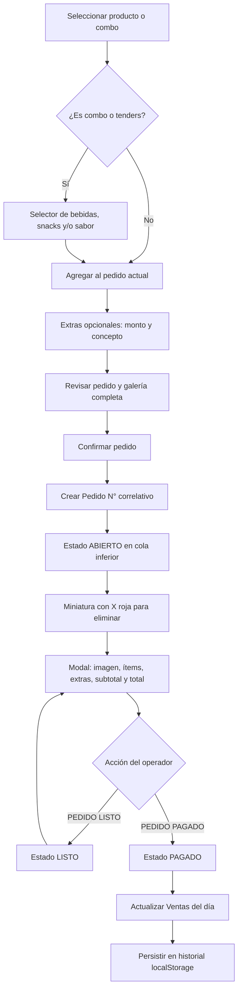

# Freeze Monkey POS

Punto de venta local hecho con HTML, CSS, Tailwind CDN y JavaScript ES6+. Todos los archivos del sitio están en esta carpeta. El catálogo usa las 27 fotografías proporcionadas en `assets/img/productos/`.

## Abrir localmente

Abre `index.html` con doble clic en tu navegador. El catálogo, las fechas y todas las acciones se cargan desde scripts locales, compatibles con `file://`, sin instalar nada ni iniciar un servidor. Conserva las carpetas `js`, `css` y `assets` junto al archivo HTML.

También puedes ejecutar `python3 -m http.server 8000` desde la raíz de `FreezeMonkeyCV/` y abrir `http://localhost:8000`. En GitHub Pages, publica la raíz del repositorio. Tailwind y la fuente Inter usan CDN; su disponibilidad no impide iniciar el POS y el CSS local mantiene la interfaz utilizable sin ellos.

Los datos se guardan por navegador y ubicación: si pasas de `file://` a `localhost` o GitHub Pages, exporta el expediente JSON desde la ubicación anterior e impórtalo en la nueva.

## Operación

1. Toca un producto. Los productos individuales entran directamente al pedido actual; combos y tenders abren un selector sin salir del menú.
   Al agregar, duplicar o quitar productos sueltos, el pedido detecta automáticamente **Viral** (1 bebida + 1 snack), **Ozaru** (2 bebidas + 2 snacks), **Tender** (1 bebida + 1 orden de tenders) y **Manada** (2 bebidas + 1 Caja Salvaje). Todas las bebidas participan. Viral/Ozaru admiten dedos de queso, papas francesas, papas gajo, salchipulpos y aros de cebolla. Cuando las promociones compiten, se aplica la combinación de menor total. Por ejemplo, dos Viral automáticos se convierten en un Ozaru al completar las dos bebidas y los dos snacks. Se conservan sabores, productos sobrantes y extras. Los combos elegidos directamente desde su selector mantienen su selección. Esta regla se aplica al pedido actual; los pedidos ya confirmados conservan sus importes originales.
2. Escribe una **etiqueta opcional** (hasta 60 caracteres), por ejemplo «A domicilio · Ana» o «Mesa 2». Puedes editarla desde el desglose mientras el pedido no esté pagado; aparece en la cola y el historial y se conserva en los expedientes JSON/CSV. Agrega extras con monto positivo y concepto. Se suman al subtotal en tiempo real.
3. Pulsa **Crear pedido** para revisar todos los productos, extras y el total. Esta pantalla muestra una galería completa y únicamente el botón **Confirmar pedido**. Hasta confirmarlo, puedes cerrar la revisión y seguir editando el pedido actual. Al confirmar, se asigna un número correlativo persistente y estado `ABIERTO`.
4. Abre la miniatura en la cola inferior para ver el desglose y añadir o quitar extras. `PEDIDO LISTO` cambia el estado a `LISTO`; `PEDIDO PAGADO` registra la fecha de pago, cierra la cola y actualiza **Ventas del día**.
5. La X roja elimina un pedido abierto tras confirmar. El número correlativo no se reutiliza.
6. **Historial** agrupa los pedidos por día. Selecciona una fecha en la columna izquierda para ver ventas, productos vendidos, cantidades por categoría y las tarjetas de sus pedidos. Se abre en el día más reciente y recuerda la selección mientras uses el POS. Ambas columnas tienen scroll independiente; en móvil se apilan. **Guardar expediente** descarga JSON. **Opciones** permite descargar JSON, exportar CSV compatible con Excel e importar un expediente JSON o CSV generado por este POS. La importación reemplaza los datos locales tras confirmar.
7. La cola inferior es compacta. Cada pedido muestra hasta 4 miniaturas; a partir de 5 ítems, muestra 3 miniaturas y `+N` con la cantidad restante. El botón de flecha hacia abajo oculta la barra y deja una pestaña **Pedidos** para volver a mostrarla. El navegador recuerda esa preferencia.

**Opciones → Reiniciar datos para un nuevo día** abre una confirmación con opción de guardar un expediente JSON antes de continuar. Al confirmar, elimina todos los pedidos, ventas, historial y borrador de este navegador y devuelve la numeración a 1. Cancelar conserva los datos. Los expedientes descargados y el catálogo no se modifican.

Los datos quedan en `localStorage` de este navegador y origen. Guarda copias JSON periódicas; no hay sincronización entre dispositivos ni integración con una terminal de cobro. El botón `PEDIDO PAGADO` registra un pago indicado por el operador.

## Catálogo y reglas

- Bebidas: $60. Los nombres de frappés y smoothies vienen de los archivos proporcionados. Hay dos limonadas: **Limonada de Fresa** y **Limonada Azul**, ambas a $60 y con imagen pendiente. Para añadir sus fotografías, colócalas en `assets/img/productos/` y cambia su ruta `image` en `js/menuData.js`.
- Snacks: $40, salvo dedos de queso a $50. Tenders naturales, BBQ o búfalo: $70.
- Caja Salvaje: $179, como producto individual en **Snacks**, y también incluida en **Combo Manada**. No sustituye un snack de Viral/Ozaru.
- Combo Viral: $95. Se interpreta como 1 bebida y 1 snack, dado que la cantidad no estaba especificada.
- Combo Ozaru: $180, con 2 bebidas y 2 snacks a elección.
- Combo Manada: $289, con **2 bebidas y 1 Caja Salvaje**. El desglose muestra la caja a $179 y un descuento de $10 sobre los $299 individuales. Los expedientes anteriores con platón de snacks conservan su desglose e importe originales.
- Combo Tender: $120, con tenders de sabor elegido y 1 bebida.

El precio final de cada combo es fijo. El detalle muestra el valor unitario de los componentes conocidos y un ajuste del combo; elegir dedos de queso no cambia el precio fijo.

El resumen del historial cuenta únicamente pedidos `PAGADO`, agrupados por fecha local de `paidAt`; en expedientes anteriores sin fecha de pago usa `createdAt`. Los pedidos `ABIERTO` y `LISTO` aparecen en su fecha de creación y no suman a los KPIs. El importe incluye extras y el precio fijo del combo. El conteo de productos desglosa cada combo en sus componentes, sin contar también el combo padre; la Caja Salvaje (o el platón de expedientes anteriores) cuenta como una unidad. Los extras no cuentan como productos. Las categorías se obtienen del catálogo usando `productId`/`id`, con respaldo de los metadatos del componente; si un producto importado no puede identificarse, se incluye en el total de productos y se indica su cantidad sin categoría.

La función `groupOrdersByDay(orders)` agrupa y ordena las fechas; `summarizeHistoryDay(orders)` calcula los KPIs y `renderHistory(date)` muestra el día solicitado o el más reciente. `orderCardMarkup(order)` comparte las tarjetas y miniaturas con la cola de pedidos abiertos.

## Flujo de un pedido

## Decisiones de interacción

Se usan tarjetas grandes de un toque, filtros visibles, selección requerida dentro de combos, un panel de pedido que siempre muestra el total y acciones de estado grandes. La [biblioteca de patrones de Mobbin](https://mobbin.com/) clasifica patrones como añadir al carrito, diálogos y hojas inferiores; no se pudo verificar una pantalla concreta de Square, Clover o Toast dentro de Mobbin desde este entorno. Como contraste funcional, la [documentación de Square](https://squareup.com/help/us/en/article/8634-customize-item-details-settings) describe añadir artículos directamente cuando no requieren variantes y abrir detalles cuando sí las requieren. [Square también documenta combos](https://squareup.com/help/us/en/article/8558-create-and-sell-combos), y [Clover documenta grupos de modificadores](https://docs.clover.com/dev/docs/managing-modifier-groups-modifiers). La interfaz aplica esos principios a los bocetos proporcionados.

La tipografía es Inter con fallback del sistema; sus cifras y rótulos mantienen buena lectura en botones y totales. Los colores se tomaron de los bocetos: azul marino `#0F2B5C`, café `#8A7659`, beige `#B69A6B`, amarillo `#FFDF63`, verde `#08BF70` y rojo `#F84443`.

## Estructura

- `index.html`: interfaz y diálogos.
- `css/styles.css`: maquetación adaptable y colores.
- `js/menuData.js`: catálogo, precios y validación de combos.
- `js/posEngine.js`: selección, extras, pedidos, cola y vistas.
- `js/storage.js`: persistencia y expediente JSON / CSV.
- `assets/img/productos/`: imágenes locales.

## Publicación

El sitio no tiene backend y puede servirse como archivos estáticos. Antes de usarlo en producción, confirma que el alojamiento elegido permite el uso comercial previsto y que los equipos de caja cuentan con respaldos periódicos. Los datos guardados en un navegador no aparecerán en otro.

## Comprobaciones de regresión

`node tests/combo-regression.cjs` verifica todas las combinaciones de bebida/snack, sabores de tenders, conversión progresiva a Ozaru y conservación de productos. Compara el total automático con todas las asignaciones posibles de promociones en 315 escenarios de cantidades, sin dependencias adicionales.

Con Node.js y Playwright (WebKit y Chromium) instalados, ejecuta `node tests/pos-regression.cjs`. Usa navegadores aislados sin tocar los datos de caja. Comprueba el modal con 1, 3, 9 y 24 productos en cinco tamaños, incluyendo teléfono vertical y horizontal; etiquetas, persistencia, expedientes actuales/anteriores y confirmación/cancelación del reinicio. El historial se verifica en esos mismos tamaños: selección y foco, estilos compartidos, KPIs solo de pagados, extras, componentes de combos, expedientes anteriores, pagos cerca de medianoche en Mérida y scroll independiente. El servidor de prueba se inicia y cierra automáticamente. Si Playwright está en otra carpeta, indica su directorio de paquetes con `NODE_PATH`.

El diálogo de pedido tiene altura explícita y zonas desplazables para evitar la compresión del contenido en WebKit. En móvil, galería y desglose se recorren verticalmente. Las referencias a CSS/JS llevan una versión para solicitar los parches nuevos al publicar en GitHub Pages.
